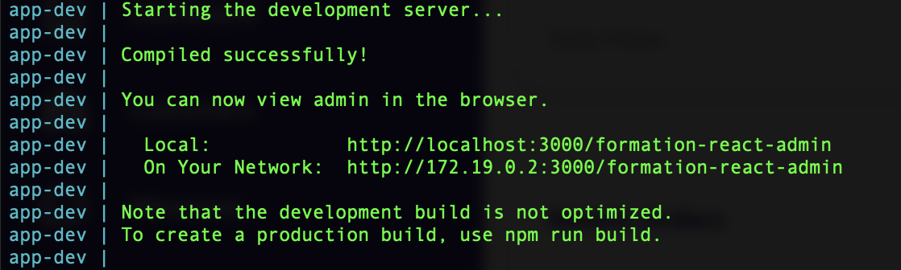
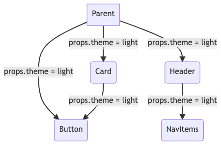
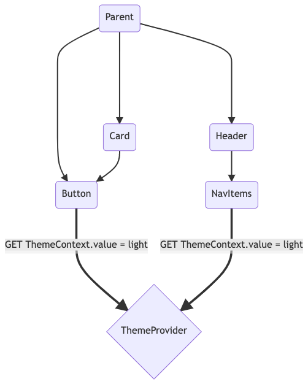

[@cy_hue](https://twitter.com/cy_hue) - [https://horsty.fr](https://horsty.fr)

---

# Formation React

Note: #formation #kanoma
#typescript #test #front #javascript
Librairie javascript pour créer des interfaces utilisateurs

---

### Prérequis :

- Docker installé
- Lancer la commande et screen du terminal :

  ```
  docker-compose -f docker-compose.dev.yml up
  ```

- Changer de branche et screen du projet http://localhost:3000 :
  ```
  git checkout starter
  ```

note:
Extension setup :
recommandation sous vscode

---



---


---

### Déroulé de la matiné

- Présentation café / croissant
- Présentation React
- Javascript modern
- Présentation react théorique
- Premier composant
- Déjeuner

Note: On va voir :

- les contextes
- les hooks
- les props

---

### Objectif de la journée


---

### React c'est quoi ?

- Librairie open source
- Pousse à l'utilisation de composant reutilisable
- Permet de modifier la donnée sans recharger la page
- Rapide, simple, evolutif

Note:

- synchroniser l'état de l'application avec l'interface utilisateur. Ex ajout une tache, le dom ajoute un li, un bouton pour supprimer apparait, etc. Complexité grandissante
- page avec les gros utilisateurs de react ---> grosse communauté
- React =/= framework
- Jsx (expliqué après)
  Jordan Walke - reacte sépare l'état et la vue. React est différent des autres framework. Simple en surface utilisation de JSX. Communauté
  React DOM compare l’élément et ses enfants avec la version précédente, et applique uniquement les mises à jour DOM nécessaires pour refléter l’état voulu.

---


---

### Les bases - javascript modern

---

### let + const

```js
var maVar = 0;
maVar = "toto";

// es6
let maVar = "toto";
maVar = 12;

const maConst = 12; // readonly
maConst = "bar"; // ERROR
```

Note:

- ES6 - 2015
- pas stocké dans `global`
- scope local à la fonction

---

### Arrows function

```js
function getTwice(value) {
  return value * 2;
}

const getTwice = (value) => value * 2;
```

note:

- avant chaque nouvelle fonction définissait son propre this --> c'était confusant
- binding de this (vulgariser)
- arrow function plus courte à écrire, pas de this propre on garde le this de la classe

---

### Template strings

```js
const name = "Cyril";
const adjectif = "the best";
// Avant
const phrase = "Hello " + name + ", you are " + adjectif + "!";
// Aprés
const phrase = `Hello ${name}, you are ${adjectif} !`;
```

note:

- sucre syntaxique pour construire des strings, comme la string interpolation
- placeholders
- saut de ligne concervé

---

### Destructuring - Objet (1/2)

```js
const obj = {
  foo: 1,
  bar: "baz",
  qux: "quux",
  corge: "grault",
};

const { foo, bar, qux: kanoma } = obj;

console.log(foo); // 1
console.log(bar); // baz
console.log(kanoma); // quux
console.log(corge); // undefined
```

note:

- binding utilisant le pattern matching
- extraire des données d'un tableau ou d'un objet grâce à une syntaxe dont la forme ressemble à la structure du tableau ou de l'objet.
- pouvoir ignorer des valeurs

---

### Destructuring - Array (2/2)

```js
let a, b, rest;
[a, b] = [10, 20];

console.log(a);
// expected output: 10

console.log(b);
// expected output: 20

[a, b, ...rest] = [10, 20, 30, 40, 50];

console.log(rest);
// expected output: Array [30,40,50]
```

---

### JSX (1/2)

```html
<MyButton color="blue" shadowSize="{2}">
  Cliquez ici
</MyButton>

React.createElement(
  MyButton, 
  { color: "blue", shadowSize: 2 }, 
  "Cliquez ici"
);
```

```html
<div className="sidebar" />

React.createElement(
  "div", 
  { className: "sidebar" }
);
```

Note: Cette syntaxe étant propre à React elle n'est pas comprise par le navigateur et il nous faudra donc un outil pour convertir le JSX en JavaScript. On peut utiliser différents outils pour cela (Webpack avec babel, Parcel, Rollup avec babel, Esbuild...)
https://babeljs.io/docs/en/editors/

Fondamentalement, JSX fournit juste du sucre syntaxique pour la fonction React.createElement(component, props, ...children).

Produit des élément react
Safe ! https://fr.reactjs.org/docs/introducing-jsx.html#jsx-prevents-injection-attacks

- JSX créé un objet
- on peut la fermer si la balise est vide
- ou au contraire l'ouvrir si y'a un enfant
- Les types commençant par une lettre majuscule indiquent que la balise JSX fait référence à un composant React. Ces balises sont compilées en références directes à la variable nommée, donc si vous utilisez l’expression JSX <Foo />, l’identifiant Foo doit être présent dans la portée.
- Composant == Lettre majuscule
- Balise html / natif == Lettre minuscule

---

### JSX (2/2)

```js
import React from "react";

function Hello(props) {
  return <div>Hello {props.toWhat}</div>;
}

function HelloWorld() {
  return <Hello toWhat="World" />;
}
```

---

### Déroulé de la matiné

- ~~Présentation café / croissant~~
- ~~Présentation React~~
- ~~Javascript modern~~
- ~~Présentation react théorique~~
- Premier composant
- Déjeuner

---

### Premier composant

```bash
git checkout starter
```

Essayons de refacto ce composant

```bash
git checkout first-component
```

Note: expliquer mon decoupage en composant et refacto navigation

---

### Résultat

```bash
git checkout first-component-refacto
```

---

### Déroulé de la matiné

- ~~Présentation café / croissant~~
- ~~Présentation React~~
- ~~Javascript modern~~
- ~~Présentation react théorique~~
- ~~Premier composant~~
- Déjeuner

---

### Déroulé de l'après-midi

- Hooks
- Context
- Présentation avancée Hooks + Context
- Atelier
- Fin de formation
- Surprise

note:

- Hooks -> explication 30min/45min
- context -> cas pratique 30min/45min
- hooks + context -> présentation avancé 15min
- atelier -> synthése de la formation cas pratique 1h30/2h
- fin de journée (formulaire/echange)
- surprise (pour allez plus loin / présentation exemple / biere )

---

### Hooks

- React 16.8 (breaking)
- Un état local / dans un scope de function
- Plus besoin de class
- Se branche sur le cycle de vie React

```js
git checkout start-react-hook
```

Note:
- Exemple sur branch git checkout hook-example
- Hook d'état comme useState, hook se branche sur le cycle de vie et sur la gestion d'état local
- On a aussi des Hook d'effet comme useEffect
- Possible de re render une page sans hook ? NON !
- On est sur des functions composant
- Avant on avait des classes, avec des function basé sur les cycles de vie (mount/update) maintenant on est sur des composant fonctionnel. Et les Hooks "remplacent" ça
- Example stashed
- -> cas pratique 30min/45min
- Hook -> explication autour du useState/useEffect pour le lien actif du menu -> cas concret avec appel API fake

---

### Contexte (1/2)



```js
git checkout start-custom-hook-and-context-provider
```

Note:

- C'est compliqué dés qu'on à des composant imbriqué de passer les props
- -> cas pratique 30min/45min
- Context -> exemple avec le dark / light theme --> cas concret mettre à jour cette valeur

---

### Contexte (1/2)



---

### Utilisation avancée

note: Explication du useToggle

---

### Autonomie

Actions sur les lignes du tableau et mettre à jour les KPI

---

### Aller plus loin

- Hébergement : Vercel & Netlify
- [Instagram](https://instagram-clone-nextjs-eight.vercel.app)
- [Spotify](https://spotify-clone-nextjs-nine.vercel.app)
- [Air BnB](https://airbnb-clone-nextjs-chi.vercel.app)
- [Magic-tools](https://magic-tools.netlify.app)
- [Veille react](https://www.getrevue.co/profile/sebastien-lorber?utm_campaign=Issue&utm_content=topprofilename&utm_medium=email&utm_source=React+Hebdo)

Note:

- Intégration avec Vercel pour l'upload
- passez d'une app de poke à un vrai projet
