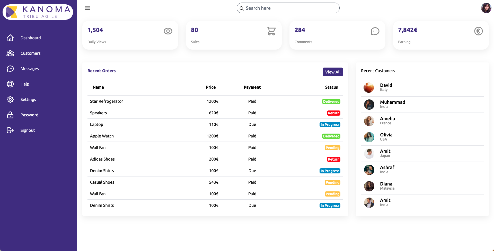

[](https://twitter.com/cy_hue)

@cy_hue

[https://horsty.fr](https://horsty.fr)

---

# Formation React

Note: #formation #kanoma
#typescript #test #front #javascript
Librairie javascript pour créer des interfaces utilisateurs

---

Prérequis : docker compose qui fonctionne + impression écran de la page final
Docker-compose 2.3.3 (1.29.2)
Support papier
docker-compose modifié pour node_modules

Extension setup :
recommandation sous vscode

---

Déroulé de la journée

- présentation café / croissant
- historique de react
- le javascript modern
- premier composant
- présentation react théorique

Note: On va voir :

- les contextes
- les hooks
- les props

---

### Objectif de la journée



---

### Pourquoi React ? Problématique :

- synchroniser l'état de l'application avec l'interface utilisateur. Ex ajout une tache, le dom ajoute un li, un bouton pour supprimer apparait, etc. Complexité grandissante
- page avec les gros utilisateurs de react ---> grosse communauté
- React =/= framework
- Jsx (expliqué après)

Note: Jordan Walke - reacte sépare l'état et la vue. React est différent des autres framework. Simple en surface utilisation de JSX. Communauté
React DOM compare l’élément et ses enfants avec la version précédente, et applique uniquement les mises à jour DOM nécessaires pour refléter l’état voulu.

---

### Les bases - javascript modern

---

- let + const

```js
var maVar = 0;
maVar = "toto";

// es6
let maVar = "toto";
maVar = 12;

const maConst = 12; // readonly
maConst = "bar"; // ERROR
```

- arrows function

```js
function getTwice(value) {
  return value * 2;
}

const getTwice = (value) => value * 2;
```

- binding de this (vulgariser)

---

- Template strings - sucre syntaxique pour construire des strings, comme la string interpolation

```js
const name = "Bob";
const time = "today";
// Avant
const phrase = "Hello " + name + ", how are you " + time + "?";
// Aprés
const phrase = `Hello ${name}, how are you ${time}?`;
```

---

- Destructuring - binding utilisant le pattern matching

```js
const obj = {
  foo: 1,
  bar: "baz",
  qux: "quux",
  corge: "grault",
};

const { foo, bar, qux: kanoma } = obj;

console.log(foo); // 1
console.log(bar); // baz
console.log(kanoma); // quux
console.log(corge); // undefined
```

---

### JSX

```js
const element = <h1>Bonjour, monde !</h1>;
```

```js
const name = "Clarisse Agbegnenou";
const element = <h1>Bonjour, {name}</h1>;
```

Safe ! https://fr.reactjs.org/docs/introducing-jsx.html#jsx-prevents-injection-attacks

Note: Cette syntaxe étant propre à React elle n'est pas comprise par le navigateur et il nous faudra donc un outil pour convertir le JSX en JavaScript. On peut utiliser différents outils pour cela (Webpack avec babel, Parcel, Rollup avec babel, Esbuild...)
https://babeljs.io/docs/en/editors/

---

Déroulé de la journée

- [x] présentation café / croissant

- [x] historique de react
- [x] le javascript modern
- [ ] présentation react théorique
- [ ] premier composant

---

### Premier composant

```bash
git clone git@github.com:Horsty80/admin.git
git checkout starter
```

Presente le projet

```bash
git checkout first-component
```

Essayons de refacto ce composant

dans la doc préparer :

- comment instancier un projet re

```bash
git checkout first-component-refacto
```

Expliquer pourquoi un children obligatoirement avec une majuscule dans la notation

---

Déroulé de la journée

9h - 12h

- [x] présentation café / croissant 9h/9h30
- [x] historique de react 9h30
- [x] le javascript moderne 10h30
- [x] premier composant 1h/1h30

---

14h - 18h

- [ ] hooks -> cas pratique 30min/45min
- [ ] context -> cas pratique 30min/45min
- [ ] hooks + context -> présentation avancé 15min
- [ ] atelier -> synthése de la formation cas pratique 1h30/2h
- [ ] fin de journée (formulaire/echange)
- [ ] surprise (pour allez plus loin / présentation exemple / biere )

---

### Hooks

"Setup react dev tools pour le projet"

Les Hooks sont arrivés avec React 16.8. Ils vous permettent de bénéficier d’un état local et d’autres fonctionnalités de React sans avoir à écrire une classe.

Les Hooks sont des fonctions qui permettent de « se brancher » sur la gestion d’état local et de cycle de vie de React depuis des fonctions composants.

```js
git checkout start-react-hook
```

Note: Hook d'état comme useState, hook se branche sur le cycle de vie et sur la gestion d'état local
On a aussi des Hook d'effet comme useEffect
Possible de re render une page sans hook ?

---

### Contexte

Le Contexte offre un moyen de faire passer des données à travers l’arborescence du composant sans avoir à passer manuellement les props à chaque niveau.

```js
git checkout start-hook-and-context-provider
```

---

Slide pour aller plus loin
Doc
Remplir questionnaire de satisfaction
PRéparer onglet de présentation de mes app persos en react
vercel
https://instagram-clone-nextjs-eight.vercel.app
https://spotify-clone-nextjs-nine.vercel.app
https://airbnb-clone-nextjs-chi.vercel.app

Netlify
https://magic-tools.netlify.app

Veille react
https://www.getrevue.co/profile/sebastien-lorber?utm_campaign=Issue&utm_content=topprofilename&utm_medium=email&utm_source=React+Hebdo

Intégration avec Vercel pour l'upload

passez d'une app de poke à un vrai projet

---

Hook -> explication autour du useState/useEffect pour le lien actif du menu -> cas concret avec appel API fake
Context -> exemple avec le dark / light theme --> cas concret mettre à jour cette valeur
Explication du useToggle
Exercice final -> supprimer ligne tableau et mettre à jour la KPI earning
Présentation de react router dom
